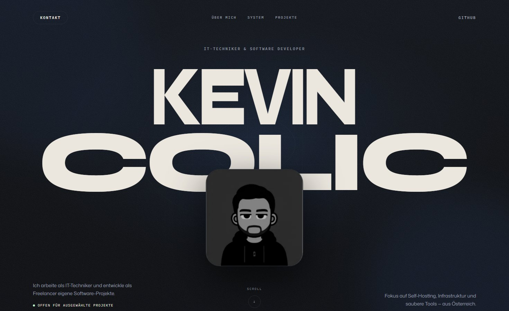

# Kevin Colic — Portfolio

Persönliche Portfolio-Website von Kevin Colic, IT-Techniker und Software-Entwickler aus Österreich — mit Fokus auf Self-Hosting, Infrastruktur und eigene Tools.



## Tech-Stack

- [Next.js 16](https://nextjs.org/) mit App Router und Turbopack
- [React 19](https://react.dev/) und TypeScript
- [Tailwind CSS 4](https://tailwindcss.com/)
- [Framer Motion](https://motion.dev/) für Animationen und Interaktionen

## Highlights

- Großformatige Hero-Typografie mit interaktivem Avatar, der dem Cursor mit Feder-Physik folgt
- Eigener Canvas-Cursor mit geschwindigkeitsabhängiger Verformung und magnetischen Links und Buttons
- „Infrastructure Signal Field“: maskiertes Koordinatenraster, Signallinien und Glow-Flächen im Hero
- Projektkarten mit cursorabhängig rotierendem Rahmen und Titel-Reveal
- System-Map-Sektion: vom ersten Request bis zu dauerhaft sicheren Daten
- Rücksicht auf Bedienbarkeit: Tastatur-Fokus-Stile, `prefers-reduced-motion`, nativer Cursor auf Touch-Geräten

## Lokale Entwicklung

```bash
npm install
npm run dev
```

Die Seite läuft anschließend unter <http://localhost:3000>.

Weitere Befehle:

```bash
npm run lint    # ESLint
npm run build   # Produktions-Build
npm run start   # Produktions-Server
```

## Projektstruktur

| Pfad                   | Inhalt                                              |
| ---------------------- | --------------------------------------------------- |
| `src/app`              | Layout, Startseite, globale Styles und Design-Tokens |
| `src/components`       | Hero, Projekte, Skills, System-Map, Custom Cursor u. a. |
| `src/data/content.ts`  | Sämtliche Texte, Skills und Projektdaten an einem Ort |
| `public`               | Avatar und Projekt-Screenshots                       |

Alle Sektionen lesen ihre Inhalte ausschließlich aus `src/data/content.ts` — Texte und Projekte lassen sich dort zentral pflegen, ohne Komponenten anzufassen.

## Kontakt

- GitHub: [@keco216](https://github.com/keco216)
- E-Mail: [kevin.colic@pm.me](mailto:kevin.colic@pm.me)
